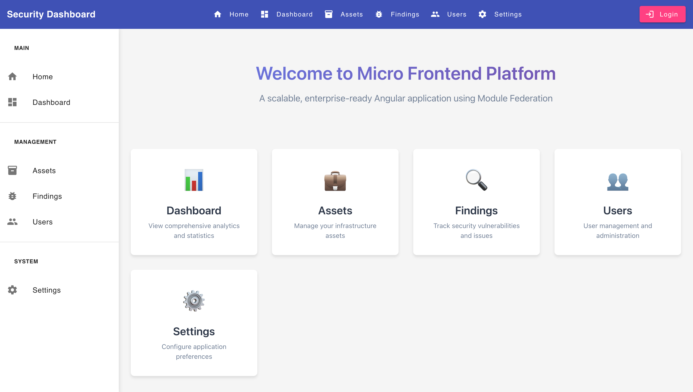
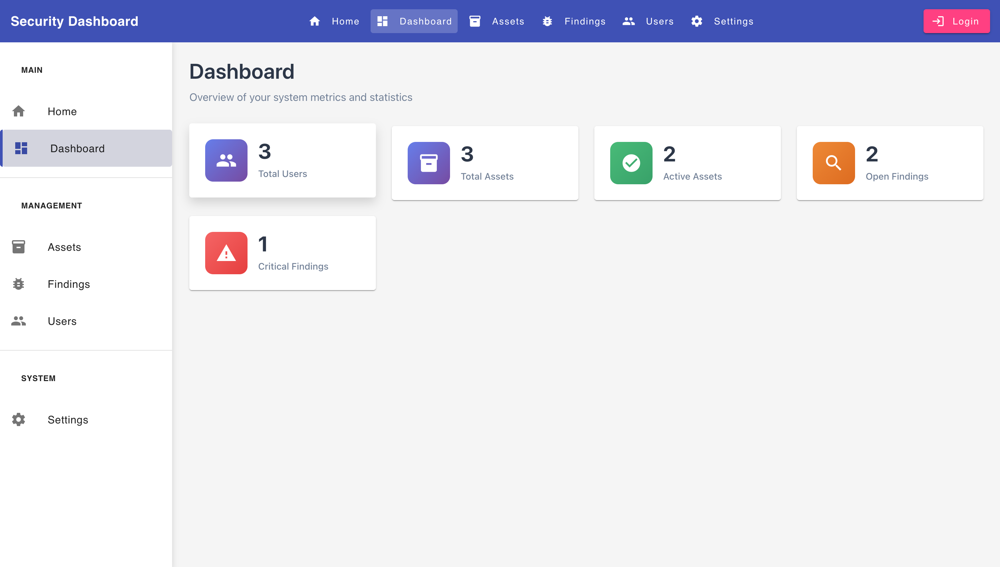
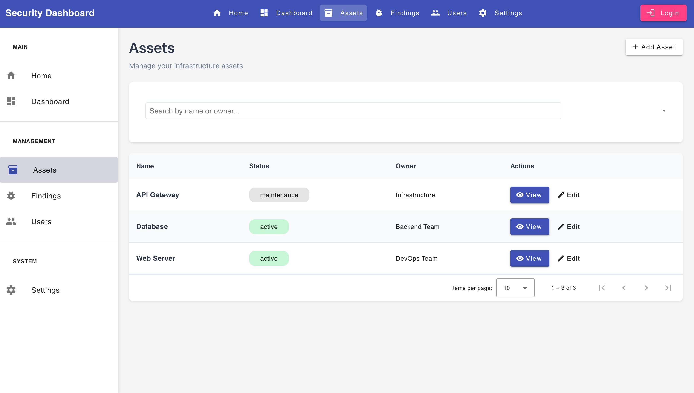
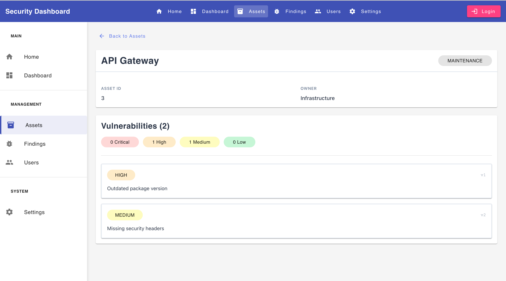
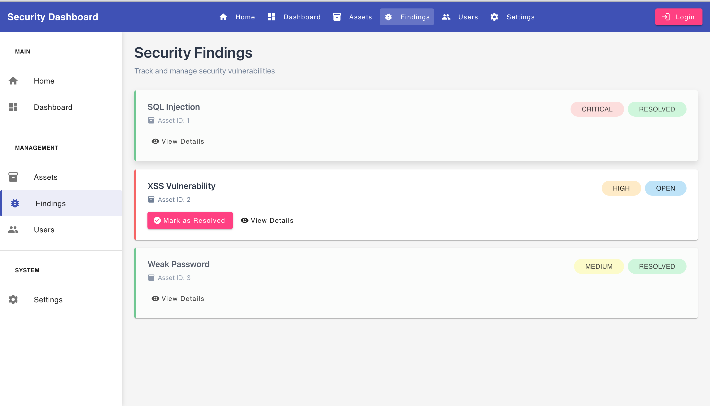
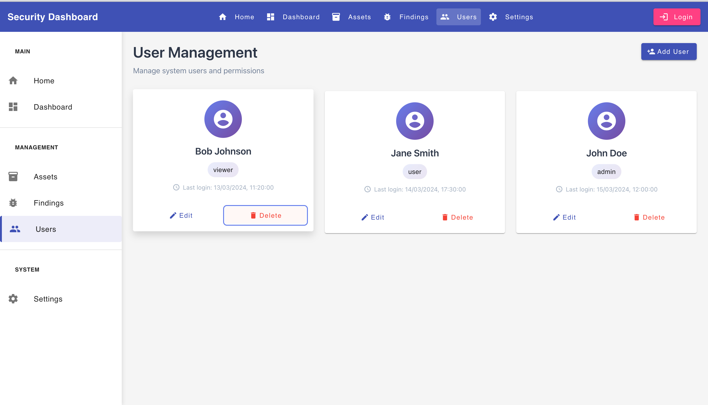
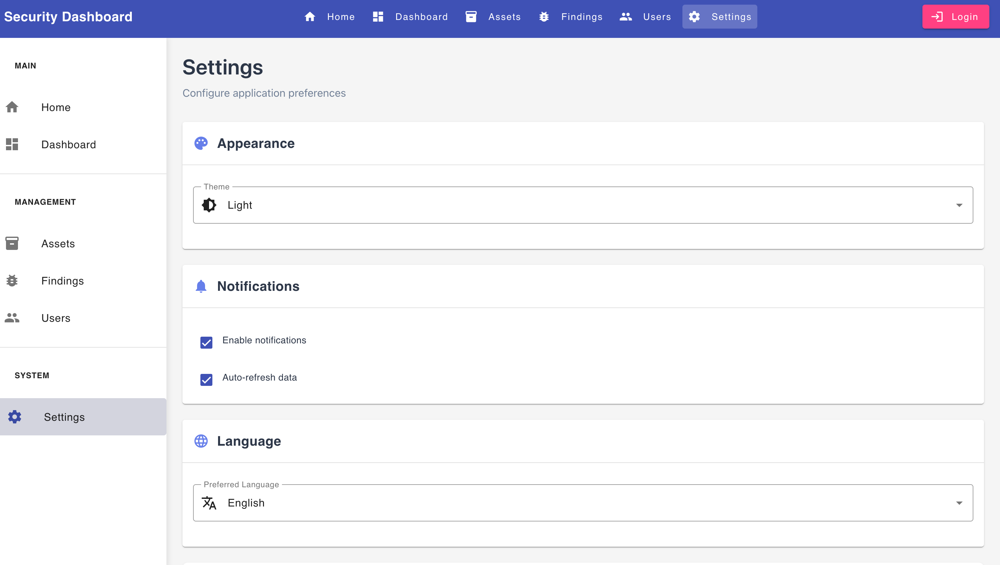

# Angular Micro-Frontend Architecture

A production-ready enterprise application built with Angular 20, Nx monorepo, Module Federation, NgRx state management, and Angular Material, demonstrating best practices for micro-frontend architecture.

## Table of Contents

- [Overview](#overview)
- [Architecture](#architecture)
- [Prerequisites](#prerequisites)
- [Quick Start](#quick-start)
- [Project Structure](#project-structure)
- [Applications](#applications)
- [Development](#development)
- [Testing](#testing)
- [Building for Production](#building-for-production)
- [Mock Server](#mock-server)
- [Improvement Notes](#improvement-notes)

## Overview

This project demonstrates a scalable micro-frontend architecture using Angular Module Federation. Each micro-frontend operates independently while sharing common libraries and maintaining a unified user experience through a shell application.

### Key Features

- **Micro-Frontend Architecture**: Independent deployable modules using Module Federation
- **Modern Angular Stack**: Angular 20 with standalone components and signals
- **State Management**: NgRx Store with effects for predictable state
- **Design System**: Angular Material for consistent UI/UX
- **Monorepo Management**: Nx workspace for efficient development
- **Type Safety**: TypeScript with strict mode enabled
- **Testing**: Comprehensive unit tests (Jest) and E2E tests (Playwright)
- **Mock Server**: MSW (Mock Service Worker) for API mocking during development

### Technology Stack

- **Framework**: Angular 20.3.0
- **Build Tool**: Nx 21.1.0
- **State Management**: NgRx Store & Effects
- **UI Library**: Angular Material 20.2.2
- **Testing**: Jest (unit), Playwright (E2E)
- **Mocking**: Mock Service Worker (MSW) 2.12.2
- **Module Federation**: Webpack Module Federation Plugin

## Architecture

The application follows a micro-frontend architecture with these key components:

### Shell Application
- Main container application running on port 4200
- Provides navigation, authentication, and layout
- Dynamically loads remote micro-frontends
- Manages shared state and routing

### Micro-Frontends

1. **Dashboard** (Port 4201) - Overview and analytics
2. **Assets** (Port 4202) - Asset management with list and detail views
3. **Findings** (Port 4203) - Security findings management
4. **Users** (Port 4204) - User administration
5. **Settings** (Port 4205) - Application configuration

### Shared Libraries

- **@angular-micro-frontend/shared**: Common models, types, and utilities
- **@angular-micro-frontend/auth**: Authentication services and guards
- **@angular-micro-frontend/api**: API client and services
- **@angular-micro-frontend/interceptors**: HTTP interceptors

### State Management

Each micro-frontend maintains its own NgRx store slice:
- Actions for all user interactions
- Reducers for immutable state updates
- Effects for side effects (API calls)
- Selectors for efficient data access

```
Store Structure:
├── shell (navigation, user)
├── assets (asset list, detail)
├── findings (findings list)
├── users (users list)
└── settings (app settings)
```


## Prerequisites

- Node.js >= 18.x
- npm >= 9.x
- Git

## Quick Start

### Installation

```bash
# Clone the repository
git clone <repository-url>
cd angular-micro-frontend

# Install dependencies
npm install
```

### Development - With Mock Server (Recommended)

Run all applications with mock API data:

```bash
npm start
```

This starts:
- Shell (http://localhost:4200)
- Dashboard (http://localhost:4201)
- Assets (http://localhost:4202)
- Findings (http://localhost:4203)
- Users (http://localhost:4204)
- Settings (http://localhost:4205)

**Accessing the Application:**

To enable Mock Service Worker, add the `?mock=true` query parameter:
```
http://localhost:4200?mock=true
```

**Important:** Without the `?mock=true` parameter, the application will attempt to connect to a real backend API and will not work without proper API configuration.

The Mock Service Worker automatically intercepts API calls and returns mock data when the query parameter is present, allowing you to develop and test without a backend.


### Development - Without Mock Server

To develop against a real backend API:

```bash
# Start individual applications
npx nx serve shell
npx nx serve dashboard
npx nx serve assets
npx nx serve findings
npx nx serve users
npx nx serve settings
```

Configure API endpoints in `apps/*/src/environments/environment.ts`

### Accessing the Application

Open http://localhost:4200 in your browser to access the shell application, which will load all micro-frontends.

## Project Structure

```
angular-micro-frontend/
├── apps/
│   ├── shell/              # Main shell application
│   ├── dashboard/          # Dashboard micro-frontend
│   ├── assets/             # Assets micro-frontend
│   │   ├── src/
│   │   │   ├── app/
│   │   │   │   ├── pages/          # Feature pages
│   │   │   │   ├── state/          # NgRx store
│   │   │   │   └── helpers/        # Utilities
│   │   │   └── public/             # Static assets (MSW worker)
│   ├── findings/           # Findings micro-frontend
│   ├── users/              # Users micro-frontend
│   ├── settings/           # Settings micro-frontend
│   └── assets-e2e/         # E2E tests for assets
├── libs/
│   ├── shared/             # Shared models and utilities
│   ├── auth/               # Authentication library
│   ├── api/                # API client library
│   └── interceptors/       # HTTP interceptors
├── tools/
│   └── mock-server/        # MSW mock server configuration
├── nx.json                 # Nx workspace configuration
├── package.json            # Dependencies and scripts
└── tsconfig.base.json      # TypeScript configuration
```

## Applications

### Shell Application

The main container that hosts all micro-frontends.

**Features:**
- Top navigation bar with routing
- Authentication flow
- Lazy loading of remote modules
- Shared layout and styling



**Routes:**
- `/` - Redirects to dashboard
- `/dashboard` - Dashboard module
- `/assets` - Assets module
- `/findings` - Findings module
- `/users` - Users module
- `/settings` - Settings module

### Dashboard

Overview and analytics dashboard.



**Features:**
- Widget-based layout
- Real-time statistics
- Quick access to other modules

### Assets

Asset management with comprehensive CRUD operations.



**Features:**
- Asset list with filtering and pagination
- Asset detail view with vulnerabilities
- Status management (active, inactive, maintenance)
- Search and filter capabilities



**Routes:**
- `/assets` - Assets list
- `/assets/:id` - Asset detail

**State Management:**
```typescript
Assets Store:
├── State: { assets: Asset[], loading: boolean, error: string | null }
├── Actions: loadAssets, loadAssetDetail, updateAssetStatus
├── Effects: API calls for CRUD operations
└── Selectors: selectAllAssets, selectAssetById, selectAssetsLoading
```

### Findings

Security findings and vulnerability management.



**Features:**
- Security findings list
- Severity filtering
- Finding resolution workflow
- Detailed finding information

### Users

User administration and management.



**Features:**
- User list with role information
- User creation and deletion
- Role management
- Email and status display

### Settings

Application configuration and preferences.



**Features:**
- Application settings
- User preferences
- Theme configuration

## Development

### Running Individual Applications

```bash
# Run shell application only
npx nx serve shell

# Run assets micro-frontend only
npx nx serve assets

# Run with production configuration
npx nx serve shell --configuration=production
```

### Code Generation

```bash
# Generate a new component
npx nx g @nx/angular:component --project=assets

# Generate a new service
npx nx g @nx/angular:service --project=shared

# Generate a new library
npx nx g @nx/angular:library my-lib
```

### Linting

```bash
# Lint all projects
npm run lint

# Lint and fix
npm run lint:fix

# Lint specific project
npx nx lint assets
```

### Dependency Graph

```bash
# View project dependency graph
npx nx graph
```

## Testing

### Unit Tests

Unit tests are written with Jest and test individual components, services, and state management logic.

```bash
# Run all unit tests
npm test

# Run tests for specific project
npx nx test assets

# Run tests in watch mode
npm run test:watch

# Run tests with coverage
npm run test:coverage
```

**Test Coverage:**
- Assets: 87 tests passing
- Findings: 50 tests passing
- Users: 42 tests passing

**Testing Patterns:**
- Component testing with mocked dependencies
- NgRx store testing with mock store
- Service testing with HTTP mocking
- Signal and computed value testing

### E2E Tests

E2E tests are written with Playwright and test complete user workflows.

```bash
# Run E2E tests
npm run e2e

# Run E2E tests for specific project
npx nx e2e assets-e2e

# Run E2E tests in headed mode
npx nx e2e assets-e2e --headed

# Debug E2E tests
npx nx e2e assets-e2e --debug
```

**E2E Test Coverage:**
- Assets navigation: List to detail page flow
- Cross-browser testing (Chromium, Firefox, WebKit)

**E2E Test Features:**
- Mock Service Worker integration for consistent test data
- Page Object Model pattern
- Automated screenshot capture on failure
- Parallel test execution

### Test Architecture

```
Testing Strategy:
├── Unit Tests (Jest)
│   ├── Components: UI logic and rendering
│   ├── Services: Business logic
│   ├── Store: State management (actions, reducers, effects)
│   └── Helpers: Utility functions
├── Integration Tests
│   └── NgRx Store: Complete state flow
└── E2E Tests (Playwright)
    └── User workflows: End-to-end scenarios
```

## Building for Production

### Build All Applications

```bash
# Build all applications for production
npm run build

# Build specific application
npx nx build assets --configuration=production

# Build with stats
npx nx build shell --configuration=production --stats-json
```

### Build Output

Production builds are output to `dist/` directory:

```
dist/
├── apps/
│   ├── shell/
│   ├── dashboard/
│   ├── assets/
│   ├── findings/
│   ├── users/
│   └── settings/
```

### Deployment Considerations

1. **Independent Deployment**: Each micro-frontend can be deployed separately
2. **Version Management**: Use semantic versioning for shared libraries
3. **Module Federation**: Ensure remote entry points are accessible
4. **Environment Variables**: Configure API endpoints per environment
5. **CDN**: Host static assets on CDN for better performance

### Production Optimization

- Tree-shaking for smaller bundle sizes
- Lazy loading for faster initial load
- Ahead-of-Time (AOT) compilation
- Production mode optimizations
- Source map generation for debugging

## Mock Server

The project uses Mock Service Worker (MSW) for API mocking during development and testing.

### Configuration

Mock handlers are defined in `tools/mock-server/handlers.ts`:

```typescript
Mock Endpoints:
├── GET /api/assets - List all assets
├── GET /api/assets/:id - Get asset by ID
├── GET /api/findings - List all findings
├── POST /api/findings/:id/resolve - Resolve finding
├── GET /api/users - List all users
├── DELETE /api/users/:id - Delete user
└── GET /api/settings - Get settings
```

### Using Mock Server

**In Development:**
```bash
npm start  # Mock server automatically enabled
```

**In Tests:**
Mock server is automatically configured in test setup files.

**In E2E Tests:**
Enable mock mode by adding `?mock=true` query parameter:
```typescript
await page.goto('/?mock=true');
```

### Mock Data

Mock data is generated using helper functions in `tools/mock-server/data-generators.ts`:
- Realistic data generation
- Consistent IDs for testing
- Configurable data sets

### Customizing Mocks

To add or modify mock responses:

1. Edit `tools/mock-server/handlers.ts`
2. Add new handlers using MSW syntax
3. Restart development server

Example:
```typescript
http.get('/api/new-endpoint', () => {
  return HttpResponse.json({ data: 'mock response' });
})
```

## Improvement Notes

### Completed Improvements

1. **Migration to Angular 20**
   - Updated to latest Angular version with standalone components
   - Implemented signal-based state management
   - Removed NgModule dependencies

2. **State Management Refactoring**
   - Migrated from component state to NgRx Store
   - Implemented effects for async operations
   - Added selectors for optimal performance

3. **Component Architecture**
   - Separated templates from components for better maintainability
   - Implemented helper classes for business logic
   - Added computed signals for derived state

4. **Testing Infrastructure**
   - Fixed all unit tests (179 tests passing)
   - Implemented E2E tests with Playwright
   - Added MSW for consistent test data

5. **Navigation Improvements**
   - Fixed routing to work in both standalone and federated contexts
   - Implemented relative navigation for flexibility
   - Added proper route guards and lazy loading

### Potential Future Improvements

#### Performance
- [ ] Implement virtual scrolling for large lists
- [ ] Add bundle size monitoring and optimization
- [ ] Implement service workers for offline capability
- [ ] Add compression for static assets
- [ ] Optimize initial bundle size with better code splitting

#### Architecture
- [ ] Implement micro-frontend communication via custom events
- [ ] Add shared component library for consistent UI
- [ ] Implement centralized error handling and logging
- [ ] Add analytics and monitoring integration
- [ ] Create a design system documentation

#### Features
- [ ] Add real-time updates using WebSockets
- [ ] Implement advanced filtering and sorting
- [ ] Add export functionality (CSV, PDF)
- [ ] Implement user preferences persistence
- [ ] Add multi-language support (i18n)

#### Testing
- [ ] Increase test coverage to >90%
- [ ] Add visual regression testing
- [ ] Implement performance testing
- [ ] Add accessibility testing (a11y)
- [ ] Create E2E tests for all user workflows

#### DevOps
- [ ] Set up CI/CD pipeline
- [ ] Add automated deployment
- [ ] Implement feature flags
- [ ] Add container support (Docker)
- [ ] Create Kubernetes deployment configurations

#### Developer Experience
- [ ] Add Storybook for component development
- [ ] Create developer documentation
- [ ] Add commit hooks for code quality
- [ ] Implement automatic changelog generation
- [ ] Add code scaffolding templates

#### Security
- [ ] Implement proper authentication (OAuth2/OIDC)
- [ ] Add authorization and role-based access control
- [ ] Implement security headers
- [ ] Add CSRF protection
- [ ] Regular security audits and dependency updates

### Known Issues

1. **Build Warning**: Unused nx-welcome.ts file in assets app (can be safely removed)
2. **Port Management**: Running multiple development servers requires all ports to be free
3. **Module Federation**: Remote entry points must be built before shell can load them

### Contributing

When contributing to this project:

1. Follow the existing code style and patterns
2. Write unit tests for new features
3. Update documentation as needed
4. Use conventional commits for commit messages
5. Ensure all tests pass before submitting PR

### Code Style

- Use TypeScript strict mode
- Follow Angular style guide
- Use signals for reactive state
- Implement proper error handling
- Write self-documenting code with clear naming

---

## License

MIT

## Support

For questions or issues, please open an issue in the repository.
